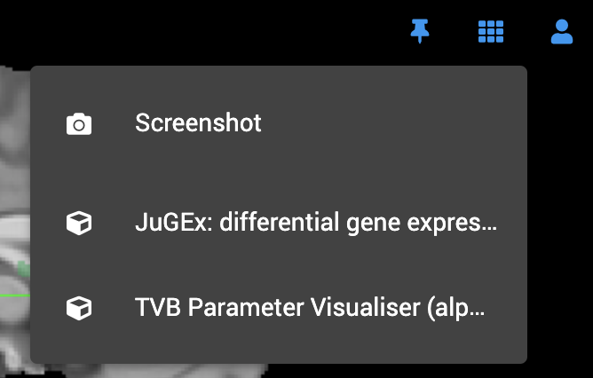
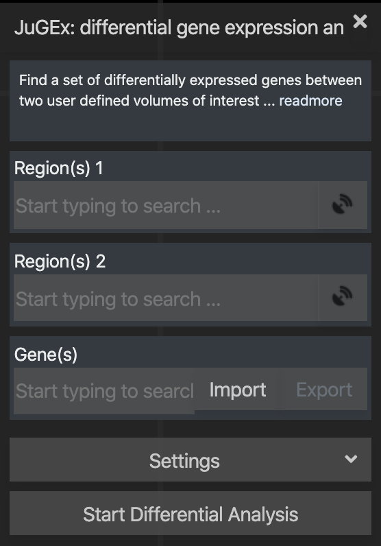

# Getting Started

WebJuGEx is available as a plugin in the [EBRAINS interactive atlas viewer](http://atlases.ebrains.eu/viewer/). To access it, select the reference template `ICBM 2009c Nonlinear Asymmetric` and the active parcellation atals `JuBrain Cytoarchitectonic Atlas`. Then, launch the plugin via `Plugin and Tools` icon at the top-right corner of the viewer:

This will launch the default user interface of the plugin

