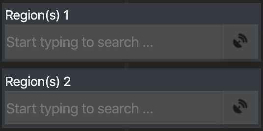
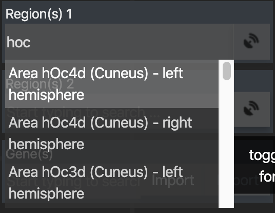
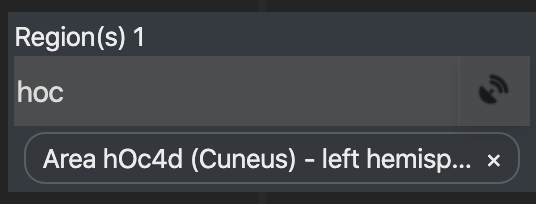
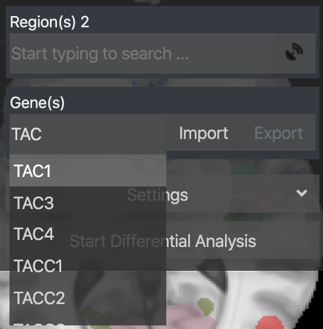
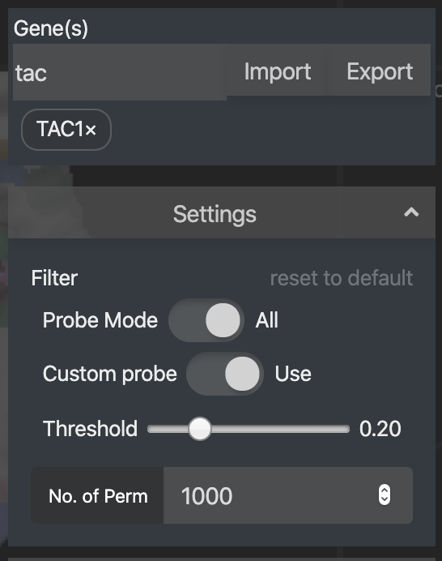

# Setting Inputs and Parameters

The launched interface allows users to interactively define analysis parameters

## Brain regions

Two different brain regions of interest need to be specified. Each brain region can consist of one or more parcellated regions from the JuBrain atlas. The selection can be performed in two different ways:

| simple text search | interactive viewer search |
| --- | --- |
| Entering any part of the name of the region(s) of interest, a filtered search result will appear | Toggled by the `signal` icon on the right side of the input field. When `on`, clicking on regions in the interactive viewer will toggle select the region in the ROI |
|  |  |

## Candidate genes

The next input field allows to specify a list of candidate genes. As for the regions, this can be done by repeatedly typing a gene name into the text field, and selecting from the autocompletion list.

Once a list has been assembled, it can be downloaded and stored on your local disk as a text file in json format. In turn, if you had previously stored a gene list to disk, you can import it with the corresponding button instead of specifying them again.

## Setting analysis parameters

Before running the differential gene expression analysis, you can modify basic settings via the settings menu. 

| parameter name | description | possible values (__default value__) |
| --- | --- | --- | 
| `Probe Mode ` | The single-probe mode focuses on specific isoforms/splice variants by analyzing the expression level of each oligoprobe individually; the all-probes mode averages the probe data using a winsorized mean. | All / Single (__All__) |
| `Custom Probe` | Decides whether the custom probes, partially used by the Allen Brain Institute, should be included or ignored. | Use / Ignore (__Use__) |
| `Threshold` | Map threshold that determine  the portion of the map to be used; the larger the threshold, the smaller the VOIs. | 0.05 - 1.00 (__0.20__) | 
| `No. of Perm` | Rounds of permuted n-way ANOVAs, which will be calculated. | (__1000__) |

