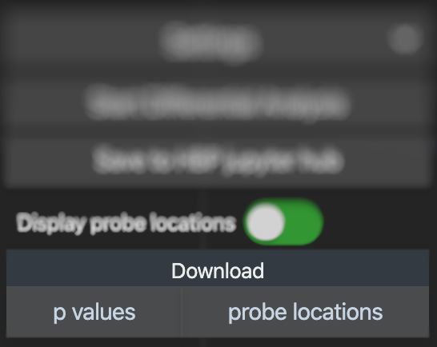

# Analysis Result

## Preview

### Probe locations

By activating the “Display proble locations” switch, the positions of the tissue probes that were retrieved for the analysis will be shown as landmarks in the 3D view of the viewer.

## Export and Download

### Export computation result

Using the download buttons at the bottom of the window, you can store the computed p values along with the probe locations as a structured text file in tsv format on your computer.

### Save computation inputs and parameters

!!! tips
    You do not need to wait until the computation is complete before saving the inputs and parameters as ipynb.

Further than retrieving the results of the experiment, you can retrieve the Python code that will reproduce the experiment as a JuPyter notebook. The notebook will be stored in the collaboratory system of EBRAINS, and you will be directed to the notebook. This will allow you to repeat the experiment in a programmatic fashion, to learn using the pyjugex Python client and modify the experiment, and as an advanced user to setup batch computations for the differential gene expression analysis.

