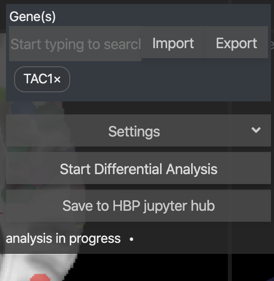

# Running Analysis

By clicking `Start Differential Analysis`, the experiment will be started. The plugin will retrieve the required gene expressions from the Allen Atlas in the background, compute the differential gene expsions, and provide threse results for inspection and download.

During the computationg, you will see the status message `analysis in progress`. This may take a while, up to a few minutes.